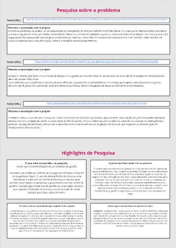
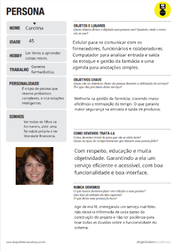
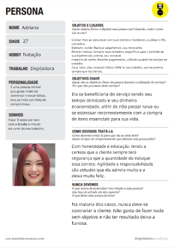
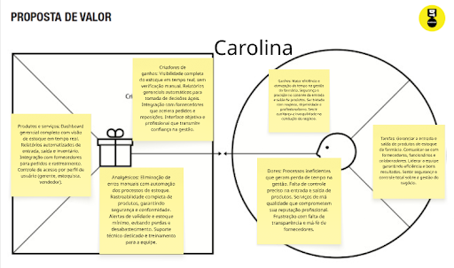
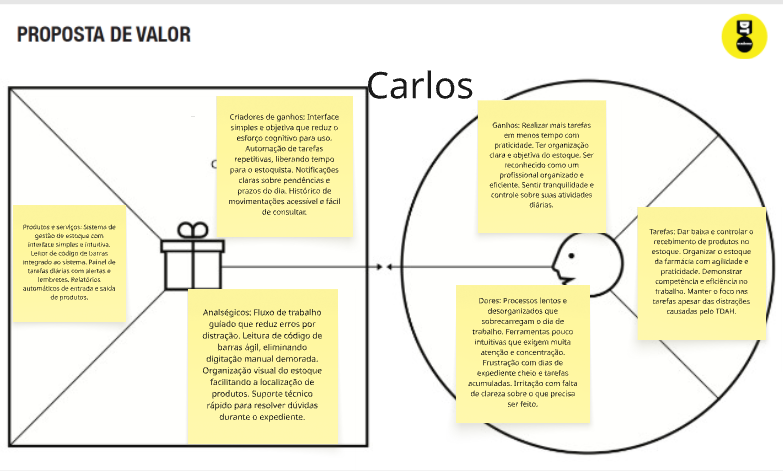
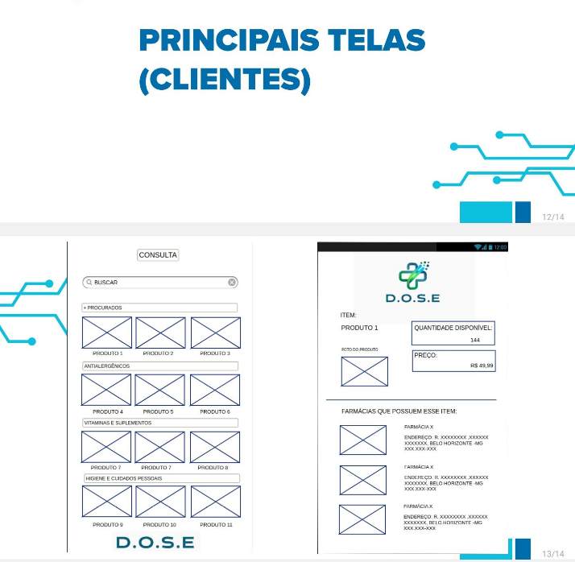

# Introdução

Informações básicas do projeto.

* **Projeto:** D.O.S.E - Dashboard de Operações e Sistema de Estoque
* **Repositório GitHub:** [[LINK PARA O REPOSITÓRIO NO GITHUB](https://github.com/ICEI-PUC-Minas-PPLES-TI/plf-es-2026-1-ti1-7620100-alunos-da-d-o-s-e-2.git)]
* **Membros da equipe:**

  * [Beatriz Carvalho Ferreira](https://github.com/beatrizf777)
  * [Igor Costa Carvalho Campos Silva](https://github.com/igorrCarvalho) 
  * [Isadora Ferreira Alvarenga](https://github.com/isadoraalvarenga)
  * [Maria Eduarda Madeira Santana](https://github.com/MariaEMadeira)
  * [Samuel Ferreira Gil](https://github.com/SamuelfGil)

A documentação do projeto é estruturada da seguinte forma:

1. Introdução
2. Contexto
3. Product Discovery
4. Product Design (**A entrega da fase de Concepção finaliza aqui**)
5. Metodologia
6. Solução
7. Referências Bibliográficas

✅ [Documentação de Design Thinking (MIRO)](img/dthinking.png)

# Contexto

Gestão de estoque ineficiente e desorganizada, resultando em diversos problemas operacionais, como a presença de medicamentos vencidos e a indisponibilidade de itens que, segundo o sistema, ainda estariam em estoque. Essa falha compromete o controle, gera desperdícios e pode impactar diretamente a qualidade do atendimento, e gerar risco à vida. Com isso, temos como o objetivo do projeto, melhorar a gestão do estoque de pequenas farmácias, evitando esses empecilhos acima citados.

## Problema

O grande problema identificado são as consequências geradas pela falta de um gerenciamento de estoque prático e que realmente funcione no dia a dia, visto que, além de falta de organização e perda de lucro, um medicamento vencido administrado a um paciente ou a falta dele pode acarretar no falecimento de um ser humano, bem como no fechamento do estabelecimento, levando em consideração que em média 84% da farmácias brasileiras são microempresas.    

## Objetivos
### Objetivo Geral

A D.O.S.E  tem como principal objetivo solucionar problemas no ramo logístico farmacêutico, tendo como foco a gestão e aprimoramento de estoques, visando a o equilíbrio e crescimento da saúde no país além da manutenção e crescimento da economia visto que 84% das farmácias brasileiras são micro farmácias e maior parte delas fecham devido a mal gerenciamento do estoque.

---

### Objetivos Específicos

* Melhorar o controle de entradas e saídas de produtos  
* Reduzir erros no gerenciamento de estoque  
* Auxiliar na tomada de decisões com base em dados  
* Diminuir perdas e falta de medicamentos  

## Justificativa

A gestão ineficiente de estoque é uma das principais causas de prejuízo em pequenos estabelecimentos farmacêuticos. Diferente de grandes redes, farmácias independentes raramente dispõem de sistemas robustos e integrados, ficando vulneráveis a erros humanos e à falta de visibilidade sobre seu próprio inventário. Uma solução acessível, simples e direcionada a esse perfil de negócio tem potencial direto de impacto na saúde financeira do estabelecimento e na qualidade do atendimento prestado à população. E é nesse cenário que surge a DOSE, criando um sistema totalmente voltado para esse contexto, visando as pessoas incluídas nesse problema no dia a dia, desenvolvendo uma plataforma otimizada e simples, para o melhor uso desses usuários.

## Público-Alvo

Gestores/proprietários de pequenas farmácias, responsáveis pelas decisões estratégicas como compras com fornecedores, análise de estoque e controle financeiro.
Colaboradores/atendentes, que usam o sistema no dia a dia para registrar entradas e saídas de produtos, precisando de uma interface simples e rápida.
Clientes da farmácia, como a Adriana, que são impactados indiretamente pela qualidade da gestão do estoque — esperando encontrar os produtos que precisam disponíveis no momento da compra.


# Product Discovery

## Etapa de Entendimento

* Pesquisa e entendimento do problema:

>
> * **Matriz CSD**:
> * **Mapa de stakeholders**: 
> * **Entrevistas qualitativas**: série de entrevistas qualitativas para validar suposições e solucionar as dúvidas com as principais pessoas envolvidas;
> * **Highlights de pesquisa**: um compilado do levantamento realizado por meio das entrevistas.

## Etapa de Definição

### Personas






# Product Design

## Histórias de Usuários


## Proposta de Valor

##### Proposta de valor para Persona Adriana


##### Proposta de valor para Persona Carolina


##### Proposta de valor para Persona Felipe


##### Proposta de valor para Persona Carlos



## Projeto de Interface

Fluxo do usuário: O quadro abaixo pode ser acessado de forma interativa:

[Quadro no Miro](https://miro.com/app/board/uXjVGzLfF8I=/)

### Wireframes

##### TELA HOME cliente

Essas duas telas representam uma visão do cliente no sistema



### User Flow


### Protótipo Interativo

Protótipo Interativo:
[Quadro no Miro](https://marvelapp.com/prototype/11hf6ide/screen/98666031)

# Metodologia

O desenvolvimento do projeto utiliza a metodologia **Scrum**, baseada em ciclos curtos de desenvolvimento (Sprints), permitindo entregas contínuas e evolução constante do sistema.

## Ferramentas

Relação de ferramentas empregadas pelo grupo durante o projeto.

| Ambiente                    | Plataforma | Link de acesso                                     |
| --------------------------- | ---------- | -------------------------------------------------- |
| Processo de Design Thinking | Miro       | https://miro.com/app/board/uXjVGzLfF8I=/        |
| Repositório de código     | GitHub     | https://github.com/ICEI-PUC-Minas-PPLES-TI/plf-es-2026-1-ti1-7620100-alunos-da-d-o-s-e-2.git     |
| Hospedagem do site          | Render     | https://site.render.com/XXXXXXX ⚠️ EXEMPLO ⚠️ |
| Protótipo Interativo       | MarvelApp  | https://marvelapp.com/prototype/11hf6ide/screen/98666031  |
|                             |            |                                                    |

| Gestão do Projeto (Kanban) | Trello       | https://trello.com/invite/b/64b73fb99972d88cf43d4e4d/ATTIaf5ee966d5b4ba3d2bc80372624d0e3a3C60B2B5/stakeholders        |
| Protótipo Interativo     | Pencil Project     | https://pencil.evolus.vn/      |
| Protótipo Interativo          | Justinmind     | https://www.justinmind.com/ |
| Comunicação e Reuniões       | WhatsApp / Discord  | https://www.whatsapp.com/    &     https://discord.com/   |
|                             |            |                                                    |

> Ferramentas Empregadas

A execução deste projeto utilizou ferramentas voltadas para a construção de wireframes e para a organização da comunicação entre os membros:

Pencil Project e Justinmind: Ambas as ferramentas foram utilizadas para a elaboração dos wireframes do projeto. A escolha de utilizar duas plataformas distintas ocorreu pela necessidade de divisão de trabalho entre os integrantes; enquanto um membro desenvolvia uma parte do layout no Pencil Project, outro utilizava o Justinmind para construir as demais telas, garantindo a integridade e a entrega do projeto final.

WhatsApp: Utilizado como o canal principal de comunicação para alinhamentos rápidos, decisões de grupo e coordenação de prazos.

Discord: Empregado para a realização de reuniões pontuais com o uso do recurso de compartilhamento de tela, permitindo que os membros visualizassem e ajustassem o design em conjunto e em tempo real.

Trello: Ferramenta utilizada para a implementação do quadro de tarefas (Kanban), permitindo o monitoramento visual do progresso do trabalho.

## Gerenciamento do Projeto

Divisão de papéis no grupo e apresentação da estrutura da ferramenta de controle de tarefas (Kanban).
Durante o desenvolvimento são realizadas atividades como:

- levantamento de requisitos;
- planejamento das funcionalidades;
- desenvolvimento incremental;
- testes das funcionalidades;
- validação com a equipe;
- documentação do projeto.

Organização da Equipe e Processo de Trabalho: 

O grupo estruturou seu processo de trabalho utilizando metodologias ágeis e o framework Scrum, adaptando as práticas para o ambiente acadêmico com foco na colaboração direta. A equipe realizou encontros presenciais na unidade da PUC Minas (Praça da Liberdade) após o horário das aulas para a definição de escopo e distribuição de tarefas.


Divisão de Papéis:

Gestão e Prototipagem: O desenvolvimento ocorreu de forma paralela, com membros trabalhando simultaneamente em diferentes partes da interface. Enquanto um integrante trabalhava na estrutura base utilizando o Pencil Project, o outro utilizava o Justinmind para desenvolver as demais telas, garantindo fluidez e agilidade.

Gestão de Configuração (GitHub): A responsabilidade pelo repositório foi concentrada em um dos membros da equipe, que cuidou da organização geral e do envio dos arquivos. Um segundo integrante colaborou em uma parcela menor desta etapa, auxiliando na configuração de partes específicas do repositório para assegurar o versionamento correto de toda a documentação.

Processo de Design Thinking:
O desenvolvimento seguiu as etapas de Design Thinking para garantir que o painel atendesse às necessidades dos usuários. Durante os encontros presenciais, o grupo realizou as fases de Imersão e Ideação para discutir o escopo e funcionalidades. A fase de Prototipação transformou essas ideias em representações visuais através das ferramentas de diagramação escolhidas.


Quadro de Controle de Tarefas (Kanban)
Para o monitoramento do status de desenvolvimento em tempo real, utilizou-se a ferramenta Trello. A estrutura do quadro foi organizada para permitir o controle visual do fluxo de trabalho:

Para fazer: Atividades pendentes, como a entrega final no portal Canvas, documentação completa e organização do repositório no GitHub.

Em progresso: Tarefas em execução, como o aperfeiçoamento dos slides e revisão da metodologia.

Feitas: Etapas concluídas, incluindo o planejamento inicial, definição de escopo e a criação dos wireframes no Pencil Project e Justinmind.

Abaixo, apresenta-se a captura de tela do quadro preenchido, evidenciando o acompanhamento das tarefas e a evolução do cronograma:


# Solução Implementada

O **D.O.S.E.** oferece uma solução completa para o gerenciamento de estoque em farmácias, centralizando todas as informações em um único sistema.

Entre seus principais recursos destacam-se:

- gerenciamento completo do estoque;
- cadastro e edição de produtos;
- controle de preços;
- registro de descartes;
- localização dos produtos dentro da farmácia;
- integração entre unidades da rede;
- consulta da farmácia mais próxima com determinado medicamento disponível;
- dashboards com gráficos para acompanhamento do estoque e das operações.

Com essas funcionalidades, o sistema proporciona maior organização, redução de perdas, aumento da produtividade dos funcionários e apoio à tomada de decisões gerenciais.


## Vídeo do Projeto

O vídeo a seguir traz uma apresentação do problema que a equipe está tratando e a proposta de solução. ⚠️ EXEMPLO ⚠️

[](https://www.youtube.com/embed/70gGoFyGeqQ)


## Funcionalidades

Esta seção apresenta as funcionalidades da solução.Info

##### Funcionalidade 1 - Cadastro de Produtos ⚠️ EXEMPLO ⚠️

Permite a inclusão, leitura, alteração e exclusão de produtos para o sistema.

* **Estrutura de dados:** [Contatos](#ti_ed_contatos)
* **Instruções de acesso:**
  * Abra o site e efetue o login
  * Acesse o menu principal e escolha a opção Cadastros
  * Em seguida, escolha a opção Contatos
* **Tela da funcionalidade**:


> ⚠️ **APAGUE ESSA PARTE ANTES DE ENTREGAR SEU TRABALHO**
>
> Apresente cada uma das funcionalidades que a aplicação fornece tanto para os usuários quanto aos administradores da solução.
>
> Inclua, para cada funcionalidade, itens como: (1) titulos e descrição da funcionalidade; (2) Estrutura de dados associada; (3) o detalhe sobre as instruções de acesso e uso.

## Estruturas de Dados

Descrição das estruturas de dados utilizadas na solução com exemplos no formato JSON.Info

##### Estrutura de Dados - Contatos   ⚠️ EXEMPLO ⚠️

Contatos da aplicação

```json
  {
    "id": 1,
    "nome": "Leanne Graham",
    "cidade": "Belo Horizonte",
    "categoria": "amigos",
    "email": "Sincere@april.biz",
    "telefone": "1-770-736-8031",
    "website": "hildegard.org"
  }
  
```

##### Estrutura de Dados - Usuários  ⚠️ EXEMPLO ⚠️

Registro dos usuários do sistema utilizados para login e para o perfil do sistema

```json
  {
    id: "eed55b91-45be-4f2c-81bc-7686135503f9",
    email: "admin@abc.com",
    id: "eed55b91-45be-4f2c-81bc-7686135503f9",
    login: "admin",
    nome: "Administrador do Sistema",
    senha: "123"
  }
```

> ⚠️ **APAGUE ESSA PARTE ANTES DE ENTREGAR SEU TRABALHO**
>
> Apresente as estruturas de dados utilizadas na solução tanto para dados utilizados na essência da aplicação quanto outras estruturas que foram criadas para algum tipo de configuração
>
> Nomeie a estrutura, coloque uma descrição sucinta e apresente um exemplo em formato JSON.
>
> **Orientações:**
>
> * [JSON Introduction](https://www.w3schools.com/js/js_json_intro.asp)
> * [Trabalhando com JSON - Aprendendo desenvolvimento web | MDN](https://developer.mozilla.org/pt-BR/Learn/JavaScript/Objects/JSON)

## Módulos e APIs

Esta seção apresenta os módulos e APIs utilizados na solução

**Images**:

* Unsplash - [https://unsplash.com/](https://unsplash.com/) ⚠️ EXEMPLO ⚠️

**Fonts:**

* Icons Font Face - [https://fontawesome.com/](https://fontawesome.com/) ⚠️ EXEMPLO ⚠️

**Scripts:**

* jQuery - [http://www.jquery.com/](http://www.jquery.com/) ⚠️ EXEMPLO ⚠️
* Bootstrap 4 - [http://getbootstrap.com/](http://getbootstrap.com/) ⚠️ EXEMPLO ⚠️

> ⚠️ **APAGUE ESSA PARTE ANTES DE ENTREGAR SEU TRABALHO**
>
> Apresente os módulos e APIs utilizados no desenvolvimento da solução. Inclua itens como: (1) Frameworks, bibliotecas, módulos, etc. utilizados no desenvolvimento da solução; (2) APIs utilizadas para acesso a dados, serviços, etc.

# Referências

## Referências Bibliográficas

* [Farmácias são interditadas por causa de venda irregular de remédio controlado e medicamento vencido](https://g1.globo.com/pe/pernambuco/noticia/2020/01/16/farmacias-sao-interditadas-por-causa-de-venda-irregular-de-remedio-controlado-e-medicamento-vencido.ghtml)

* [Caso procedimento estético: Ingrid morreu após aplicação do anestésico local](https://www.band.com.br/bandnews-fm/rio-de-janeiro/noticias/caso-procedimento-estetico-ingrid-morreu-apos-aplicacao-do-anestesico-local-16610526)

* [5 Desafios Ocultos na Gestão de Estoque que Podem Comprometer a Eficiência da Sua Farmácia](https://gfarmabrasil.com.br/gestao-de-estoque/)

* [Guia completo: controle de estoque de farmácia](https://www.inovafarma.com.br/blog/controle-de-estoque-de-farmacia/)

* [84% das farmácias no Brasil são micro e pequenas empresas](https://agenciasebrae.com.br/dados/84-das-farmacias-no-brasil-sao-micro-e-pequenas-empresas/)

* [Farmácias independentes fecham mais do que abrem e indicam nova fase do varejo farmacêutico no Brasil](https://sincofarmasp.com.br/2026/02/18/farmacias-independentes-fecham-mais-do-que-abrem-e-indicam-nova-fase-do-varejo-farmaceutico-no-brasil/)

* [Controle de estoque em farmácias e drogarias: principais desafios e melhores práticas](https://inventorybrasil.com.br/2021/06/04/controle-de-estoque-em-farmacias-e-drogarias-principais-desafios-e-melhores-praticas/)

* [Falta de medicamentos](https://descartuff.uff.br/2022/08/06/2127/)

* [Falta de medicamentos afeta principalmente estoque das farmácias, diz presidente do Sindhosp](https://www.cnnbrasil.com.br/saude/falta-de-medicamentos-afeta-principalmente-estoque-das-farmacias-diz-presidente-do-sindhosp/)

* [Reposição de produtos é maior desafio na gestão de estoque](https://panoramafarmaceutico.com.br/maior-desafio-na-gestao-de-estoque/)
